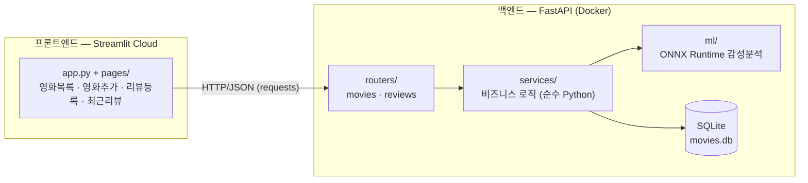
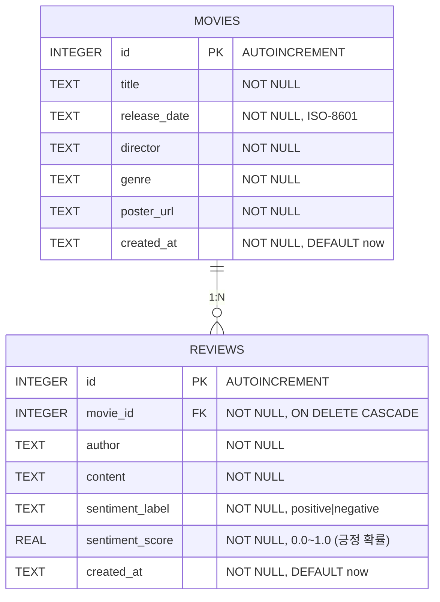

# 미션 18 기술문서 — 영화 리뷰 감성 분석 웹 서비스

> **문서 성격**: `미션18소개.txt`(기획 문서)를 구현 가능한 기술 명세로 변환한 문서.
> 설계 근거는 파트4 학습 자료(FastAPI, Streamlit, 모델 경량화, Docker/배포)에 기반한다.
> 팀/작성자: 5팀 이아인

---

## 1. 서비스 개요

영화 정보와 사용자 리뷰를 관리하고, 리뷰 등록 시 **한국어 감성 분석 모델이 자동으로 긍/부정을 판별**해 표시하는 웹 애플리케이션.

| 구분 | 선택 | 근거 |
|---|---|---|
| 프론트엔드 | Streamlit (멀티페이지) | 미션 지정. Streamlit Cloud 배포 |
| 백엔드 | FastAPI + Uvicorn | 미션 지정. 모든 데이터/추론은 백엔드에서 관리 |
| DB | SQLite | 파일 하나로 동작하는 프로토타입 최적 DB. 트래픽 규모(과제)에 충분 |
| 감성 분석 | NSMC 파인튜닝 한국어 모델 → ONNX + 동적 양자화 | §6 참조 |
| 배포 | 프론트: Streamlit Cloud / 백엔드: Docker 컨테이너 (심화: GCP Cloud Run) | §8 참조 |

**핵심 제약 (기획서 명시)**
- 모든 데이터는 백엔드에서 관리한다. Streamlit 내부 저장 기능(파일 쓰기, 자체 DB)은 사용하지 않는다.
- 프론트엔드는 오직 HTTP API로만 백엔드와 통신한다.

---

## 2. 요구사항 정의 (기획 → 기능 명세)

### 2.1 기능 요구사항

| ID | 구분 | 요구사항 | 우선순위 |
|---|---|---|---|
| F-01 | 영화 | 영화 등록 — 제목, 개봉일, 감독, 장르, 포스터 URL | 필수 |
| F-02 | 영화 | 전체 영화 목록 조회 | 필수 |
| F-03 | 영화 | 특정 영화 조회 | 필수 |
| F-04 | 영화 | 특정 영화 삭제 | 심화 |
| F-05 | 리뷰 | 리뷰 등록 — 영화 선택, 작성자 이름, 리뷰 내용 | 필수 |
| F-06 | 리뷰 | 전체/특정 영화 리뷰 조회 | 필수 |
| F-07 | 리뷰 | 리뷰 삭제 | 심화 |
| F-08 | 감성분석 | 리뷰 등록 시 자동 감성 분석 실행, 결과(라벨+점수) 저장·표시 | 필수 |
| F-09 | 평점 | 영화별 평균 평점 = 해당 영화 리뷰들의 감성 점수 평균 | 필수 |
| F-10 | UI | 영화 목록 화면: 제목, 포스터, (옵션) 평균 평점 | 필수 |
| F-11 | UI | 최근 리뷰 10개 표시: 영화 ID, 등록일, 리뷰 내용, 감성 결과 | 필수 |

### 2.2 비기능 요구사항

| ID | 요구사항 | 구현 방식 |
|---|---|---|
| N-01 | 감성 모델은 서버 기동 시 1회만 로드 | FastAPI `lifespan` 패턴 (§4.2) |
| N-02 | 추론 중 다른 API 요청 블로킹 금지 | `run_in_threadpool` 위임 (§4.2) |
| N-03 | 모델 경량화 적용 및 근거 제시 | ONNX 변환 + 동적 양자화, 벤치마크로 검증 (§6) |
| N-04 | 입력 검증 | Pydantic 스키마 = 신뢰의 경계 (§4.3) |
| N-05 | CORS는 프론트 도메인만 허용 | CORSMiddleware, 와일드카드 금지 (§9) |
| N-06 | SQL 인젝션 방지 | 파라미터화 쿼리만 사용 (§5) |

---

## 3. 시스템 아키텍처

파트4 학습 자료의 **3계층(3-Tier) 아키텍처** 원칙을 적용한다. 각 계층은 관심사를 분리하고, 데이터는 항상 UI → 애플리케이션 → 추론 방향으로 흐른다.



**요청 흐름 예시 — 리뷰 등록(F-05, F-08)**
1. 사용자가 Streamlit 리뷰 등록 페이지에서 영화 선택 + 작성자/내용 입력 (`st.form`으로 묶어 중간 재실행 차단)
2. Streamlit이 `POST /reviews`로 JSON 전송
3. FastAPI가 Pydantic 스키마로 입력 검증 (신뢰의 경계)
4. 서비스 계층이 감성 분석 실행 — 동기 ONNX 추론을 `run_in_threadpool`로 스레드 풀에 위임
5. 리뷰 + 감성 라벨/점수를 SQLite에 저장
6. 저장 결과(감성 결과 포함)를 JSON으로 응답 → Streamlit이 결과 표시

**계층 분리 원칙 (학습 자료 기반)**
- 라우터는 `routers → schemas`, `routers → services` 방향으로만 의존한다.
- `services/`의 핵심 로직(전처리·추론·후처리)은 FastAPI에 의존하지 않는 순수 Python으로 작성해 재사용성을 확보한다.

---

## 4. 백엔드 설계 (FastAPI)

### 4.1 프로젝트 구조

학습 자료의 단일 책임 원칙(SRP) 기반 권장 구조를 따른다.

```text
backend/
├── app/
│   ├── main.py            # 앱 조립 + lifespan + 미들웨어 등록만
│   ├── config.py          # BaseSettings — 환경변수(.env) 관리
│   ├── database.py        # SQLite 연결/초기화
│   ├── schemas.py         # Pydantic 요청/응답 스키마
│   ├── routers/
│   │   ├── movies.py      # /movies 라우터
│   │   └── reviews.py     # /reviews 라우터
│   ├── services/
│   │   ├── movie_service.py
│   │   └── review_service.py   # 리뷰 저장 + 감성분석 호출
│   └── ml/
│       ├── loader.py      # ONNX 세션 로드 (lifespan에서 1회)
│       └── predictor.py   # 토크나이즈 → 추론 → softmax (순수 Python)
├── ml_assets/             # 양자화된 .onnx + tokenizer 파일
├── scripts/
│   ├── export_onnx.py     # HF 모델 → ONNX 변환 + 동적 양자화
│   └── benchmark.py       # 경량화 전/후 속도 측정 (§6.3)
├── tests/
├── requirements.txt
└── Dockerfile
```

### 4.2 모델 생명주기와 비동기 처리

**모델 로드 (N-01)** — `@asynccontextmanager` 기반 `lifespan`에서 서버 기동 시 ONNX 세션을 딱 한 번 로드하고, 종료 시 해제한다. 요청마다 로드하는 안티패턴을 차단한다.

```python
@asynccontextmanager
async def lifespan(app: FastAPI):
    model_manager.load("ml_assets/sentiment_int8.onnx")   # startup: 1회 로드
    yield
    model_manager.session = None                          # shutdown: 해제

app = FastAPI(lifespan=lifespan)
```

**추론 비동기 처리 (N-02)** — ONNX `session.run()`은 CPU 집약적 **동기 연산**이므로 `async def` 엔드포인트에서 직접 호출하면 이벤트 루프가 점유되어 모든 동시 요청이 정지한다. 반드시 스레드 풀로 위임한다.

```python
from fastapi.concurrency import run_in_threadpool

score = await run_in_threadpool(predictor.predict, review.content)
```

### 4.3 Pydantic 스키마 (신뢰의 경계)

요청 스키마는 **입력 방어**, 응답 스키마는 **출력 계약**으로 역할을 분리한다.

```python
class MovieCreate(BaseModel):                    # 입력 방어
    title: str = Field(min_length=1, max_length=200)
    release_date: date
    director: str = Field(min_length=1, max_length=100)
    genre: str = Field(min_length=1, max_length=50)
    poster_url: HttpUrl                          # URL 형식 검증

class ReviewCreate(BaseModel):
    movie_id: int = Field(ge=1)
    author: str = Field(min_length=1, max_length=50)
    content: str = Field(min_length=1, max_length=2000)

class SentimentLabel(str, Enum):                 # Enum으로 선택지 제한
    POSITIVE = "positive"
    NEGATIVE = "negative"

class ReviewResponse(BaseModel):                 # 출력 계약
    id: int
    movie_id: int
    author: str
    content: str
    sentiment_label: SentimentLabel
    sentiment_score: float = Field(ge=0.0, le=1.0)   # 긍정 확률
    created_at: datetime
```

검증 실패 시 FastAPI가 자동으로 `422`를 반환하므로 별도 예외 처리가 불필요하다.

### 4.4 API 명세

라우팅 원칙: 고정 경로(`/recent`)를 매개변수 경로(`/{id}`)보다 상단에 배치해 충돌을 방지한다. 모든 엔드포인트에 `response_model`을 명시해 자동 문서화(FastAPI Docs 캡처 제출물)와 출력 필터링을 보장한다.

| 메서드 | 경로 | 기능 | 요청 | 응답 | 요구사항 |
|---|---|---|---|---|---|
| `POST` | `/movies` | 영화 등록 | `MovieCreate` | `201` `MovieResponse` | F-01 |
| `GET` | `/movies` | 전체 영화 조회 (평균 평점 포함) | — | `list[MovieResponse]` | F-02, F-09 |
| `GET` | `/movies/{movie_id}` | 특정 영화 조회 | — | `MovieResponse` / `404` | F-03 |
| `DELETE` | `/movies/{movie_id}` | 영화 삭제 (리뷰 연쇄 삭제) | — | `204` / `404` | F-04 (심화) |
| `GET` | `/movies/{movie_id}/rating` | 평균 평점 조회 | — | `{movie_id, avg_score, review_count}` | F-09 |
| `POST` | `/reviews` | 리뷰 등록 + 자동 감성분석 | `ReviewCreate` | `201` `ReviewResponse` | F-05, F-08 |
| `GET` | `/reviews` | 전체 리뷰 조회 | `?movie_id=`(선택) `?limit=10` | `list[ReviewResponse]` | F-06 |
| `GET` | `/reviews/recent` | 최근 리뷰 10개 | `?limit=10 (ge=1, le=50)` | `list[ReviewResponse]` | F-11 |
| `DELETE` | `/reviews/{review_id}` | 리뷰 삭제 | — | `204` / `404` | F-07 (심화) |
| `GET` | `/health` | 헬스체크 (모델 로드 여부 포함) | — | `{status, model_loaded}` | N-01 |

`/health`는 단순 기동 확인이 아니라 **모델 로드 완료 여부**를 함께 반환한다 — Docker `HEALTHCHECK`와 프론트엔드 기동 시 연결 확인에 사용.

---

## 5. 데이터베이스 설계 (SQLite)

### 5.1 ERD



**설계 결정**
- **평균 평점은 컬럼이 아니라 집계 쿼리로 계산** (`AVG(sentiment_score)`). 리뷰 삭제 시 정합성 관리가 필요 없어진다.
- `movie_id`에 `FOREIGN KEY ... ON DELETE CASCADE` — 영화 삭제(F-04) 시 리뷰가 고아 레코드로 남지 않는다. SQLite는 `PRAGMA foreign_keys=ON` 필요.
- 모든 쿼리는 **파라미터화 쿼리**(`?` 플레이스홀더)만 사용한다 (N-06). f-string 포매팅 금지.
- FastAPI는 요청을 멀티스레드로 처리하므로 연결 생성 시 `check_same_thread=False`를 적용한다.

---

## 6. 감성 분석 모델 — 선정과 경량화

### 6.1 모델 선정

**선정 기준**: ① 한국어 영화 리뷰 도메인 적합성 ② CPU 서빙 가능한 크기 ③ 경량화(ONNX/양자화) 호환성.

**채택 모델: [`daekeun-ml/koelectra-small-v3-nsmc`](https://huggingface.co/daekeun-ml/koelectra-small-v3-nsmc)** — KoELECTRA-Small-v3를 NSMC(네이버 영화 리뷰 15만 건)로 파인튜닝한 긍/부정 이진 분류 모델, 14.1M 파라미터.

| 후보 | 크기 | 판단 |
|---|---|---|
| **koelectra-small-v3-nsmc** | 14M | **채택.** NSMC = 영화 리뷰라 서비스 도메인과 정확히 일치, 추가 파인튜닝 불필요. base 계열의 1/8 크기로 CPU 추론·콜드 스타트에 유리 — **모델 선택 자체가 1차 경량화** |
| koelectra-base-finetuned-nsmc | ~110M | 정확도 1~2%p 우위 예상되나 8배 큼. 과제 규모에서 체감 차이 미미 |
| KcELECTRA-base (beomi) | ~110M | 사전학습 모델이라 직접 NSMC 파인튜닝 필요 — 과제 범위 초과 |
| LLM API 호출 | — | 외부 종속·비용 발생, "경량화 고민" 요구사항과 상충 |

small 모델의 정확도 트레이드오프는 §6.3 벤치마크에서 NSMC 검증 샘플로 실측해 보고서에 수치로 남긴다.

출력: 긍정 확률(softmax) → `score ≥ 0.5`면 `positive`. 이 확률(0~1)을 그대로 평점 원천값으로 사용한다(F-09).

### 6.2 경량화 전략 — 단계적 적용

학습 자료의 대원칙 — **"복잡도가 낮은 도구로 시작해, 요구 불만족 신호가 포착될 때 단계적으로 전환"** — 을 따른다.

| 단계 | 기법 | 기대 효과 | 적용 조건 |
|---|---|---|---|
| 0 | PyTorch 원본 (Baseline) | — | 속도·정확도 기준점 기록 |
| 1 | **ONNX 변환** | Operator Fusion 등 그래프 최적화로 약 2배 속도 향상, **정확도 손실 0%** | 무조건 적용 |
| 2 | **동적 양자화 (Dynamic PTQ)** | 가중치 INT8 → 모델 크기 약 1/4, 추가 학습 불필요. Linear 레이어 위주인 Transformer에 최적 | 적용 후 벤치마크·정확도 확인 |
| 3 | QAT | 학습으로 양자화 오차 보정 | 2단계에서 정확도가 허용치 이하로 하락할 때만 (본 과제에서는 미적용 예상) |

**ONNX 변환 절차** (`scripts/export_onnx.py`):
`model.eval()` 호출(BatchNorm/Dropout 고정) → 실제 입력과 동일 shape의 더미 입력 생성 → `torch.onnx.export(opset_version 명시, dynamic_axes로 배치·시퀀스 길이 가변 축 지정)`.

**주의 (학습 자료의 성능 함정)**: INT8이 무조건 빠른 것은 아니다. CPU/런타임이 INT8 가속을 지원하지 않으면 변환·복원 오버헤드로 FP32보다 느려지는 역전이 발생할 수 있다 → **배포 대상 환경에서 반드시 실측 후 채택**한다. 역전 시 1단계(ONNX FP32)로 서빙한다.

### 6.3 벤치마크 설계 (`scripts/benchmark.py`)

학습 자료의 측정 원칙을 그대로 적용한다:

1. **워밍업 10회** — 초기화 오버헤드 제거, 통계에서 제외
2. **본 측정 100회 이상** 반복
3. 보고 지표: **평균 ± 표준편차, P99 레이턴시**, 모델 파일 크기
4. 측정 구간은 토크나이즈 포함 **E2E** (전처리~후처리)

보고서에는 `PyTorch FP32 vs ONNX FP32 vs ONNX INT8` 3단 비교표 + NSMC 검증 샘플 정확도 유지 여부를 수록한다.

---

## 7. 프론트엔드 설계 (Streamlit)

### 7.1 구조

```text
frontend/
├── app.py                 # 메인 — 영화 목록 (제목·포스터·평균 평점)
├── pages/
│   ├── 1_영화_추가.py       # 숫자 접두사로 사이드바 순서 제어
│   ├── 2_리뷰_등록.py
│   └── 3_최근_리뷰.py
├── lib/
│   └── api_client.py      # requests 래퍼 — 백엔드 호출 단일 창구
├── .streamlit/
│   ├── config.toml        # 테마 등 공개 가능 설정 (Git 추적)
│   └── secrets.toml       # BACKEND_URL 등 — .gitignore 등록
└── requirements.txt
```

### 7.2 핵심 구현 원칙 (학습 자료 기반)

- **재실행 모델 대응**: Streamlit은 위젯 조작마다 스크립트 전체를 재실행한다. 유지가 필요한 상태는 `st.session_state`에 `if "key" not in st.session_state:` 패턴으로 초기화한다.
- **`st.form` 사용 (영화 추가·리뷰 등록)**: 입력 필드마다 재실행되는 낭비를 막고, `form_submit_button` 클릭 시에만 API 호출한다.
- **캐싱**:
  - `@st.cache_data(ttl=30)` — 영화 목록·리뷰 목록 등 API 응답 데이터 (복사 안전한 순수 데이터)
  - 리뷰 등록 성공 직후 `st.cache_data.clear()`로 목록 갱신
  - 모델은 백엔드에 있으므로 프론트에서 `st.cache_resource` 대상은 없음
- **기동 시 헬스체크**: 시작 시 `GET /health` 확인, 실패하면 안내 메시지 + `st.stop()`으로 이하 렌더링 중단.
- **빈 상태(Empty State) 대응**: 영화/리뷰가 없을 때 빈 화면 대신 등록 가이드를 노출한다.
- **백엔드 URL은 `st.secrets["BACKEND_URL"]`** 로 주입 — 로컬은 `secrets.toml`, 배포는 Streamlit Cloud 콘솔의 Secrets 창에 동일 TOML 입력.
- 감성 결과 표시: 긍정 😊 / 부정 😞 뱃지 + 확률. 목록은 `st.dataframe`/카드 레이아웃(`st.columns`).

---

## 8. 배포

### 8.1 프론트엔드 — Streamlit Cloud (필수)

1. 로컬 정상 동작 검증 → GitHub 리포지토리 push
2. `share.streamlit.io`에서 New app → 리포지토리/브랜치/`frontend/app.py` 매핑 → Deploy
3. Secrets 콘솔에 `BACKEND_URL` 입력
4. 이후 `main` push 시 자동 재배포

### 8.2 백엔드 — Docker 컨테이너화 (심화)

Dockerfile 작성 원칙 (학습 자료 기반):

```dockerfile
FROM python:3.11-slim                      # CPU 서빙 → slim 베이스
WORKDIR /app
COPY requirements.txt .                    # 변경 적은 레이어를 위로 (캐시 최적화)
RUN pip install --no-cache-dir -r requirements.txt
COPY app/ app/
COPY ml_assets/ ml_assets/                 # 양자화 모델 (~수십 MB라 이미지 포함)
ENV PYTHONUNBUFFERED=1                     # 로그 실시간 출력
RUN useradd -m appuser
USER appuser                               # 비root 실행
HEALTHCHECK CMD python -c "import urllib.request; urllib.request.urlopen('http://localhost:8000/health')"
CMD ["uvicorn", "app.main:app", "--host", "0.0.0.0", "--port", "8000"]   # Exec 형식 — 시그널 전달
```

- `HEALTHCHECK`는 `/health`를 호출해 **모델 로드 완료까지** 확인한다.
- (심화) **GCP Cloud Run 배포**: Artifact Registry에 push → `gcloud run deploy --memory 2Gi --cpu 2 --max-instances 3 --timeout 60`. 콜드 스타트 시 lifespan 모델 로드 지연이 추가되므로 — **INT8 양자화로 모델 크기를 줄인 것이 콜드 스타트 단축에도 직접 기여**한다(§6과 연결). 필요 시 min-instances 1.
- 로컬 통합 실행: Docker Compose로 frontend/backend 서비스 정의, 서비스명 DNS(`http://backend:8000`)로 통신, `depends_on` + `condition: service_healthy`로 모델 로드 완료 후 프론트 기동.

### 8.3 데이터 영속성 주의

Cloud Run·컨테이너는 파일시스템이 휘발성이므로 SQLite 파일은 재배포 시 초기화될 수 있다. 과제 범위에서는 시연용 시드 스크립트(`scripts/seed_db.py` — 영화 3개+영화당 리뷰 10개)로 재현 가능하게 한다. `# ponytail: SQLite 파일 DB — 영속성 필요해지면 Cloud SQL/볼륨 마운트로 교체`

---

## 9. 보안 설계

학습 자료의 다층 방어(Defense in Depth) 중 과제 규모에 맞는 층만 적용한다.

| 층 | 적용 | 내용 |
|---|---|---|
| CORS | ✅ | `allow_origins`에 Streamlit 앱 도메인만 허용. 와일드카드 + credentials 조합 금지 |
| 입력 검증 | ✅ | Pydantic 스키마 (길이 제한, URL 형식, 범위 검증) |
| SQL 인젝션 | ✅ | 파라미터화 쿼리 전용 |
| 환경변수 분리 | ✅ | `pydantic_settings.BaseSettings` + `.env` (Git 미추적) |
| API 키 인증 | 선택 | 공개 데모 서비스라 미적용. 적용 시 `APIKeyHeader` + `Depends` 체이닝 |
| Rate Limit | 미적용 | GPU 자원 없음, 과제 규모에서 불필요 |

---

## 10. 제출물 매핑 체크리스트

| 제출 요구사항 | 이 문서/산출물 대응 |
|---|---|
| 서비스 개요 | §1 |
| 서비스 구조도 (프론트·백엔드·모델 서빙) | §3 아키텍처 다이어그램 |
| DB 구조도 (ERD) | §5.1 |
| FastAPI Docs 전체 캡처 | §4.4 명세 + `response_model`/`description` 작성 → `/docs` 캡처 |
| 서비스 동작 캡처 (영화 3개+, 각 리뷰 10개+) | `scripts/seed_db.py`로 데이터 준비 후 캡처 |
| 코드 (frontend/, backend/ 구분) | §4.1, §7.1 폴더 구조 |
| (심화) 모델 경량화 고민 | §6 — 단계적 경량화 + 벤치마크 실측 |

---

## 11. 구현 순서 (검증 기준 포함)

1. **백엔드 골격 + DB** → 검증: `/docs`에서 영화 CRUD 동작
2. **모델 변환·경량화** (`export_onnx.py` → `benchmark.py`) → 검증: 3단 비교표 수치 확보, 정확도 유지
3. **리뷰 API + 감성분석 연동** → 검증: `POST /reviews` 응답에 감성 결과 포함, 동시 요청 블로킹 없음
4. **프론트엔드 4개 페이지** → 검증: 전 기능 로컬 E2E 수동 확인
5. **시드 데이터 + 배포** → 검증: Streamlit Cloud URL에서 전체 플로우 동작
6. **보고서 작성** (구조도·ERD·캡처·벤치마크 표)
